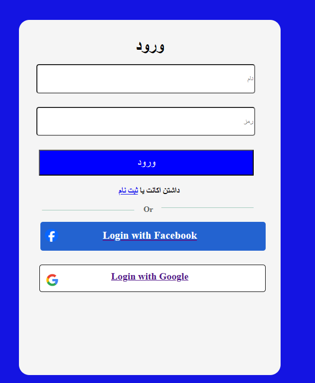
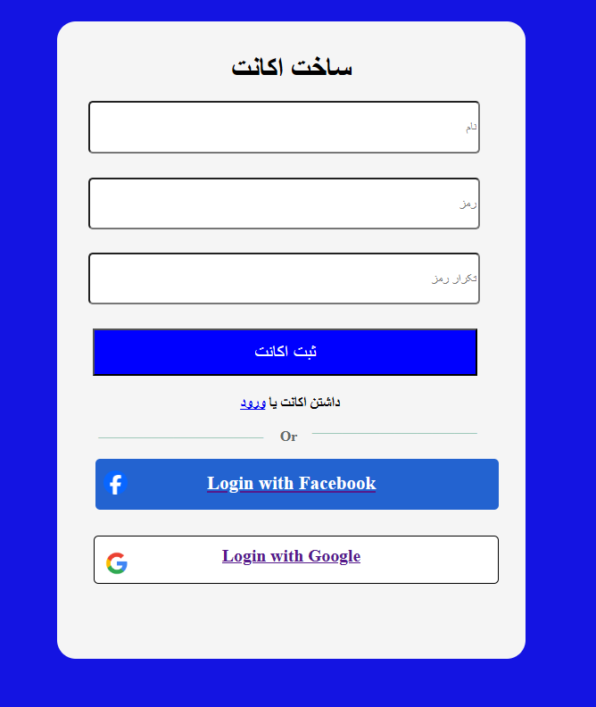
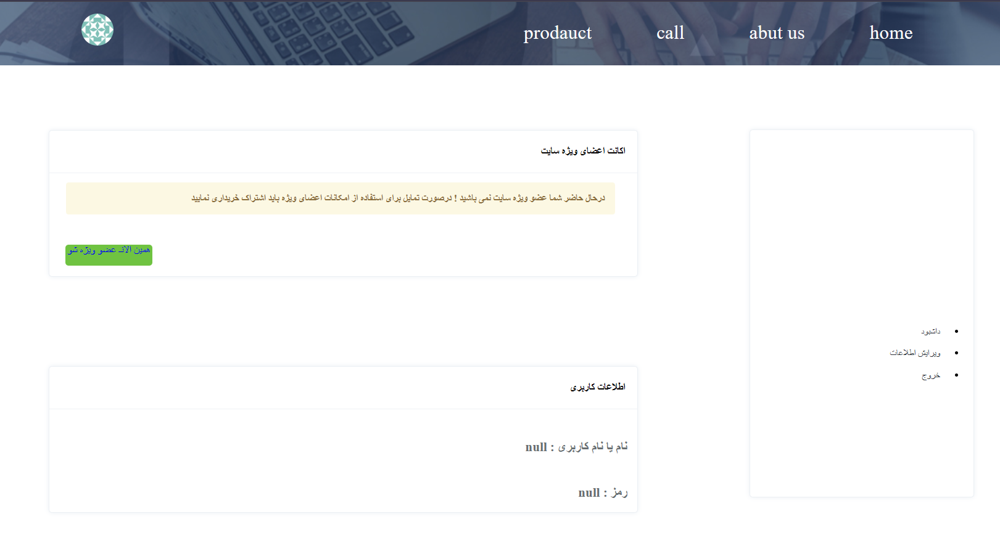

# 🔐 Awesome Login Page

A **modern, responsive login page** built with HTML, CSS, and JavaScript — designed to be clean, minimal, and user-friendly ✨

  
  
  

---

## 🚀 Live Demo

🔗 [View Online](https://benyamin012.github.io/Login-App/)

---

## ✨ Features

🎨 Beautiful and modern UI
🧩 Clean HTML structure & organized CSS
🔒 Simple validation logic with JavaScript

---

## 🛠️ Tech Stack

  
  
  

* **HTML5** – structure of the page
* **CSS3** – design, layout, animations
* **JavaScript** – interactivity and validation

---

## 🧠 What I Learned

* Creating reusable and elegant form layouts
* Handling user input and validation in JS
* Designing responsive UIs that look great on all devices

---

## 📌 Future Improvements

🔹 Add “Show/Hide Password” toggle
🔹 Connect to a real backend for authentication
🔹 Add “Forgot Password” & “Sign Up” pages

---

💻 Developed with ❤️ by **Benyamin**
